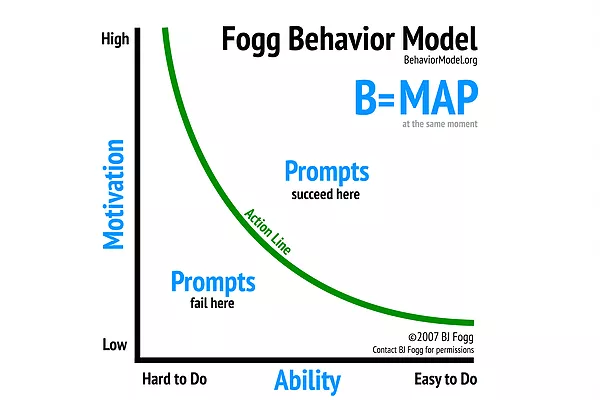

# Habits

### About motivation

Depending mainly on motivation to change habits is depending on a resource whose scarcity varies and decreases in time.

### What causes behaviour?

> The Fogg Behavior Model shows that three elements must converge at the same moment for a behavior to occur: Motivation, Ability, and a Prompt. When a behavior does not occur, at least one of those three elements is missing.

### What's the plan?

So, what's the plan to change habits? Here we go:

1. Define your habit as **tiny**.
2. Do it after a recurrent event. E.g: After dinner. 
3. Repeat everyday. 

 Perform your new tiny habit after a familiar one, using the old familiar habit as a trigger.

### Links

* [Fogg Method](https://www.foggmethod.com/)
* [Tiny Habits](https://www.tinyhabits.com/)
* [The Fogg behaviour grid helps to understand 15 types of behaviours. For each behaviour, there's a different type of approach.](https://www.behaviorgrid.org/)
* [The Behaviour Wizard](http://www.behaviorwizard.org/wp/)
* [The Fogg Behaviour Model ](https://www.behaviormodel.org/)
* [Habits by Stojanow](https://wiki.stojanow.com/habits)

